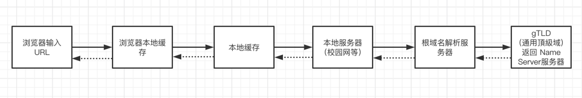

## 从输入URL到页面加载发生了什么

1. DNS解析
2. TCP链接
3. 发送HTTP请求
4. 服务器处理请求并返回HTTP报文
5. 浏览器解析渲染页面
6. 链接结束

### DNS解析

#### 概念：一个网址到IP地址的转换过程，称为DNS解析
#### 解析过程
DNS解析过程，是一个递归查询的过程。

#### DNS 优化

##### DNS 缓存
- 浏览器缓存
- 系统本地缓存
- 路由器缓存
- IPS服务器缓存
- 根域名服务器缓存
- 顶级域名服务器缓存
- 主域名服务器缓存

##### DNS 负载均衡

### TCP连接
