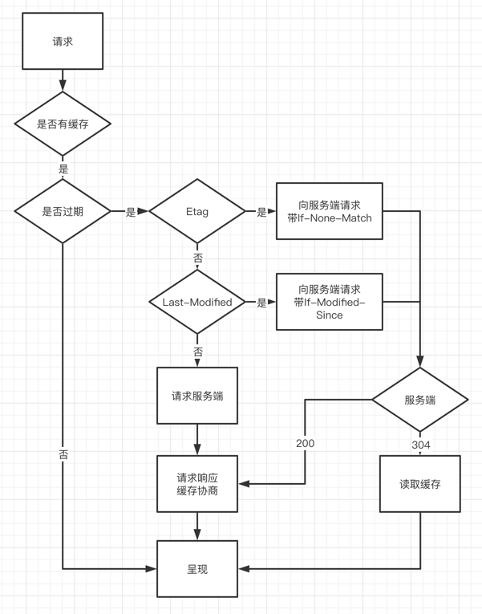

### 缓存
浏览器缓存：是指浏览器对之前请求过的文件进行缓存，以便下一次访问时重复使用，节省带宽，
提高访问速度，降低服务器压力。

http缓存机制主要在http响应头中设定，响应头中相关字段为 `Expires`、`Cache-control`、`Last-Modified`、`Etag`

### 浏览器如何判断缓存
第一次：
浏览器请求 -> 无缓存 -> 向web服务器请求 -> 请求响应，缓存协商 -> 呈现

第二次：

### 缓存类别

#### 强缓存
不会发送任何请求，直接从本地缓存中读取，staus code: 200 OK

`from memory cache`: 不访问服务器，缓存在内存中，浏览器关闭后释放

`from disk cache`: 不访问服务器，缓存在本地硬盘中，关闭浏览器数据依然存在

`memory cache`优先级高于`disk cache`

#### 协商缓存
向服务器发送请求，服务器根据请求的 `header` 的一些参数来判断是否命中，如果命中，
则返回 `304` 状态码并带上新的 `response header` 通知浏览器从缓存中读取资源

### 强缓存和协商缓存的header参数

#### 强缓存
`Expires`： 过期时间，如果设置了时间，则浏览器会在设置的时间内直接读取缓存，不在请求

`Cache-Control`：当值设置为max-age=300，则代表在这个请求正确返回时间（浏览器记录）的5分钟内再次
加载资源，就会命中强缓存

- `max-age`: 设置资源可以被缓存多长时间，单位是秒
- `s-maxage`: 和`max-age`一样，不过它只针对代理服务器缓存而言
- `public`: 指示响应可以被任何缓存区缓存
- `private`: 只能针对个人用户，而不能被代理服务器缓存
- `no-cache`: 强制客户端想服务端发送请求，服务器收到请求会判断资源是否变更，
是则返回新内容，否则返回304。这个实际上也是会缓存的，只不过是每次都会请求服务端
  查看资源的有效性。
- `no-store`: 禁止一切缓存

#### 协商缓存：
`Last-Modified`/`If-Modified-Since`和`Etag`/`If-None-Match`是分别成对出现的,
是一一对应关系

##### Etag/If-None-Match
`Etag`: `Etag`是属于Http 1.1的属性，由服务器生成返回给前端，用来帮助服务器控制Web
端的缓存验证。

`If-None-Match`: 当资源过其实，浏览器发现响应头里有`Etag`,则再次向服务器请求
带上`If-None-Match: {Etag的值}`，服务器收到请求进行对比，返回200或者304

##### Last-Modified/If-Modified-Since
`Last-Modified`: 浏览器向服务器发送资源最后的修改时间

`If-Modified-Since`: 当资源过过期时，发现响应头有`Last-Modified`声明，则再次向
服务器发送请求带上`If-Modified-Since`，标识请求时间。服务器收到请求后与被请求资源
最后的修改时间进行对比，若最后修改时间较新，则说明资源有被修改过，则返回新资源，200
没有则返回304
